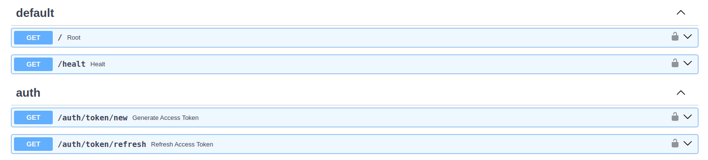

# API and WebSocket

[](https://github.com/rb58853/fastauth-api)

## Summary

- Provides two WebSocket routes for real-time chat:
  - User route (protected by an access token).
  - Admin route (protected by a master token).
- Communication is based on plain text messages and a JSON stream of steps; the stream ends with a final terminator.

## Endpoints and authentication

- Main routes:
  - `/chat/user` — requires an ACCESS token (in header).
  - `/chat/admin` — requires a MASTER token (in header).
- The server validates tokens on each connection; use secure tokens and a rotation policy.

## Connection (URL and parameters)

- Format:
  - `ws://<host>:<port>/chat/{user|admin}`
- Common query parameters:
  - `chat_id` — conversation id.
  - `model` — LLM model identifier.
  - `len_context` — desired context length (`chat_history`).

## Recommended headers

- `ACCESS-TOKEN: <jwt-access-token>` (for `/chat/user`)
- `MASTER-TOKEN: <master-token>` (for `/chat/admin`)
- `aditional_servers: <JSON-string>` — list of auxiliary services ([see example servers](../README.md#additional-mcp-servers)).

## Browser-compatible additional servers

Some browser clients cannot send custom headers in native WebSocket APIs. To support these clients, the API accepts additional servers in the first WebSocket message.

Merge behavior:

1. Parse `aditional_servers` from headers.
2. Parse additional servers from the first message only when it matches the defined syntax.
3. Merge both maps into one final object.
4. If a server key exists in both sources, the first-message value overrides the header value.

Fallback behavior:

- If the first message is not an additional-servers payload, it is treated as a normal user query.
- If no additional-servers payload is sent, the flow continues normally.
- If payload parsing fails, it is ignored and the flow continues.

Supported first-message syntax:

1. Prefix-based payload:

```text
__fastchat_additional_servers__:{"my_server":{"protocol":"httpstream","httpstream-url":"http://127.0.0.1:9000/mcp","name":"my_server","description":"Server sent from browser"}}
```

1. JSON envelope payload:

```json
{
  "type": "additional_servers",
  "data": {
    "my_server": {
      "protocol": "httpstream",
      "httpstream-url": "http://127.0.0.1:9000/mcp",
      "name": "my_server",
      "description": "Server sent from browser"
    }
  }
}
```

Use cases:

- Browser chat widget that cannot set `aditional_servers` header.
- Dynamic tenant-specific server injection from frontend runtime.
- Progressive override of static servers configured in headers.

## Message protocol (summary)

1. On connect, the server sends a JSON confirmation message.
2. The client can optionally send one first message with additional servers payload.
3. The client sends the query as plain text over the socket.
4. The server emits a sequence of JSON messages, each representing a "step" or chunk of the response.
5. When finished, the server sends a literal terminator to indicate end of stream.
6. If the client closes, the server should clean up resources and close gracefully.

## Step structure (suggested)

- Each JSON message may contain:
  - `type` — message type.
  - `content` — partial text or data.
  - `first_chunk` — boolean indicating the first fragment.
  - `meta` — step metadata (timestamp, token_usage, etc.).
- Consumer: process messages until receiving the end-of-stream marker.

## Usage examples

- URIs:
  - `ws://localhost:8000/chat/user?chat_id=my-chat&model=my-model`
  - `ws://localhost:8000/chat/admin?chat_id=my-chat`
- Headers (example):
  - `ACCESS-TOKEN: eyJ...`
  - `MASTER-TOKEN: oBd-k41TmMq...`
  - `aditional_servers: '{"github":{"protocol":"httpstream","httpstream-url":"https://api.example.com/mcp"}}'`

## Operational flow (pseudocode)

### Client

```python
open websocket to ws://host:port/chat/user with headers and query
await initial_accept_message()
send_text('{"type":"additional_servers","data":{...}}')  # optional
send_text("My question here")
for message in socket:
        if message == STREAM_END_MARKER: break
        handle_json_step(message)
close socket
```

[see example](../tests/api/websocket/chating.py)

### Server

```python
on_text_received(text):
        generator = chat_logic(text)
        for step in generator:
                send_json(step)
        send(STREAM_END_MARKER)
```

[see code](../src/fastchat/api/routes/chat.py)

## Configuration and environment

- Useful variables: `LITELLM_API_KEY`, `LITELLM_BASE_URL`, `OPENAI_API_KEY`, `MASTER_TOKEN`, `CRYPTOGRAPHY_KEY`.
- Configuration defines auxiliary services and database connections; review the [fastauth-api](https://github.com/rb58853/fastauth-api) package for details.

## auth_middleware fill in config file

*Purpose:* Supply the external auth service used by the API to validate tokens for protected chat routes (`/chat/user`, `/chat/admin`).

```json
{
    "...": "...",
    
    "auth_middleware": {
        "database_api_path": "http://127.0.0.1:6789/mydb/data",
        "headers": {
            "header_key": "header_value",
            "other_header": "header_value",
            "...": "..."
        }
    }
}
```

### *Required fields*

- `database_api_path` (string): full URL to the authentication/validation endpoint (prefer HTTPS). This is where Fastauth will query/validate tokens.
- `headers` (object): key/value HTTP headers to include on requests to the auth endpoint (e.g. `Authorization`, API keys). Use environment values for secrets.
